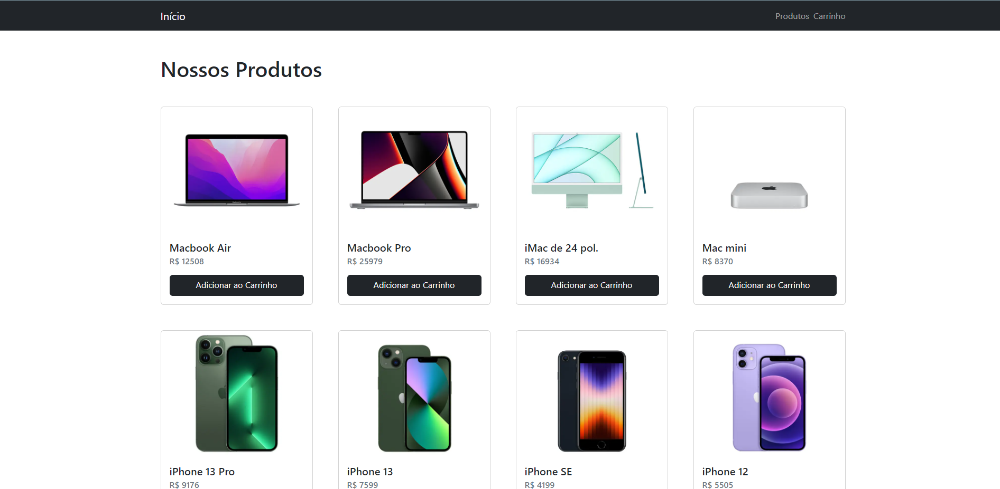
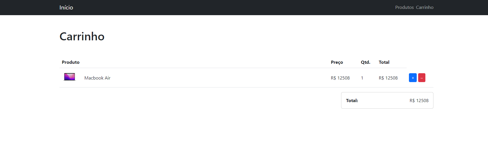

# Product Catalog Apple

#

## Welcome! 👋

Thanks for checking out this front-end coding project.

**To do this challenge, I needed of HTML, CSS and JavaScript. I needed to the libraries ReactJS and Next.js (React Framework) and Bootstrap**.

## The project

The project has with objective to build out this Product Catalog Apple and get it looking as close responsive and intuitive as possible.

Your users should be able to:

- View the optimal layout for the site depending on their device's screen size
- See hover states for all interactive elements on the page
- Add products to cart and/or remove and view price and quantity of added products

## Deploy of my project

My project is hosted on Netlify in the link below:

- [Vercel](https://black-nextjs-blond.vercel.app/)

## Built with

- Javascript
- TypeScript
- React.js
- Bootstrap - For Styles
- Flexbox
- [React](https://reactjs.org/) - JS library
- [Next.js](https://nextjs.org/)
- HTML
- CSS
